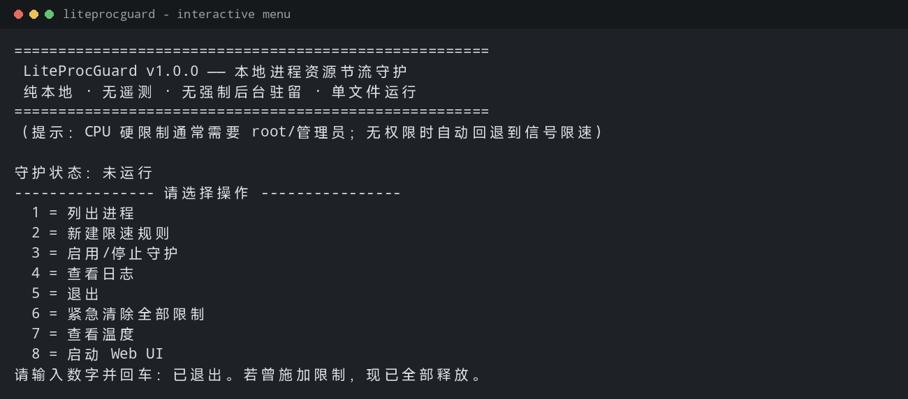
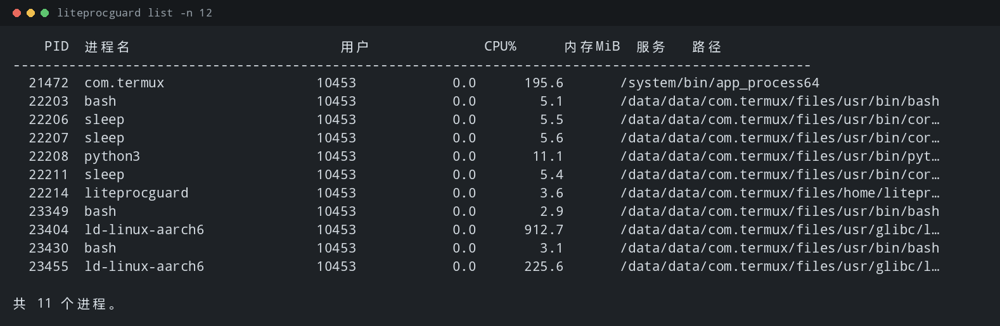
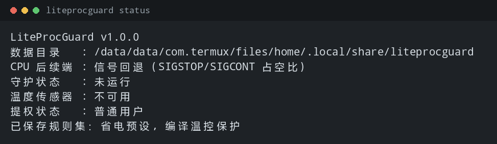
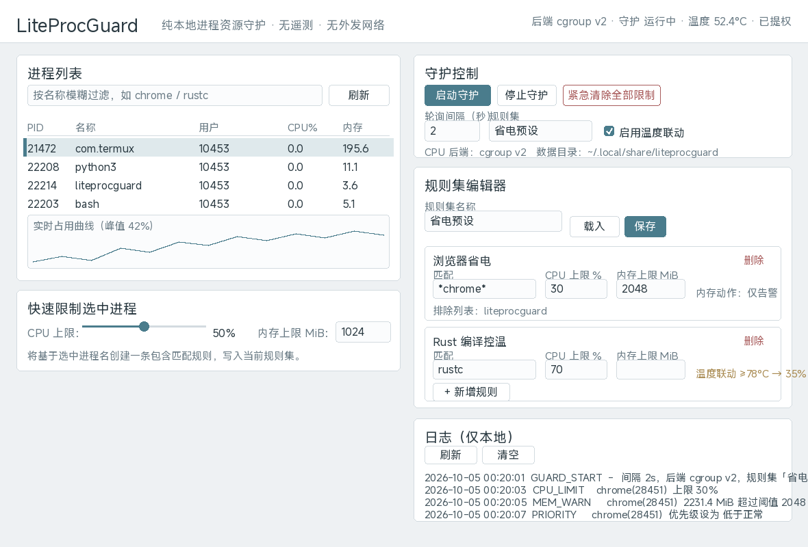

# LiteProcGuard

> 纯本地、无遥测、无 AI 依赖、无强制后台驻留的**跨平台进程资源节流守护工具**。
> 不用改内核、不用打补丁、**单文件运行**，给任意进程设置「CPU 上限 / 内存硬阈值 / 自动降权 / 超限策略」，解决软件偷偷占满 CPU、内存导致整机卡顿的痛点。

[](LICENSE)


面向人群：**老 PC 玩家、树莓派用户、Kali / Linux 折腾党、Termux 安卓用户**。

> ## ⚠️ 免责声明（请先阅读）
> 本工具是**用户态**资源管理器，**不是内核驱动**；部分进程 / 系统服务受系统保护**无法限制**。
> 请勿对关键系统进程施加限制，以免造成系统异常。**禁止用于恶意管控他人程序。**
> 使用即代表你已理解并自担风险。完整条款见文末 [免责声明](#免责声明)。

---

## 目录

- [它解决什么问题](#它解决什么问题)
- [和任务管理器 / 其它工具有什么区别](#和任务管理器--其它工具有什么区别)
- [核心特性](#核心特性)
- [截图](#截图)
- [各平台一行快速启动](#各平台一行快速启动)
- [安装](#安装)
- [使用方式](#使用方式)
- [规则、预设与配置文件](#规则预设与配置文件)
- [权限说明（必读）](#权限说明必读)
- [Windows 注意事项](#windows-注意事项)
- [树莓派专用调优示例](#树莓派专用调优示例)
- [Termux 完整上手教程](#termux-完整上手教程)
- [温度联动 / 黑名单 / 导入导出](#温度联动--黑名单--导入导出)
- [安全回滚机制](#安全回滚机制)
- [日志与隐私](#日志与隐私)
- [已知限制](#已知限制)
- [从源码构建 / 交叉编译](#从源码构建--交叉编译)
- [项目结构](#项目结构)
- [免责声明](#免责声明)
- [开源协议](#开源协议)

---

## 它解决什么问题

很多软件（浏览器、Electron 应用、后台同步、杀毒扫描、编译任务）会在后台悄悄吃满 CPU 或内存，导致：

- 整机卡顿、风扇狂转、笔记本续航暴跌；
- 树莓派 / 老 ARM 板温度飙升甚至降频、卡死；
- 安卓 Termux 里编译或跑服务时把手机烤热、系统杀后台。

传统做法要么进任务管理器手动杀进程（治标不治本，还会反弹），要么装一堆带后台常驻、带遥测、带自动更新的大型工具。

**LiteProcGuard 的思路**：一个几 MB 的单文件，按你的规则给进程**限速**而不是反复杀它，并且随时能一键完全恢复原生状态。

## 和任务管理器 / 其它工具有什么区别

| 维度 | 任务管理器 / top | 常见“管家 / 优化”软件 | LiteProcGuard |
| --- | --- | --- | --- |
| 是否杀进程 | 手动杀，进程会反弹 | 常靠杀进程“优化” | **限速为主**，温和降权/终止可选 |
| CPU 限制方式 | 无 | 大多没有 | **cgroup / Job Object 硬上限** |
| 后台驻留 | 无常驻 | 长期驻留 + 自启 | **默认不驻留**，手动开启才轮询 |
| 遥测 / 联网 | 无 | 常见遥测/自动更新 | **零外发网络，无自动更新** |
| 依赖 | 系统自带 | 大型运行时 | **单文件静态二进制，无运行时** |
| 可回滚 | 无 | 不确定 | **异常退出也尽量释放限制** |
| 跨平台 | 单一平台 | Windows 为主 | Windows + Linux + ARM + Termux |
| 可审计 | 闭源 | 闭源 | **MIT 开源，代码透明** |

一句话：它是**用户态的、克制的、可回滚的限速器**，不是又一个后台全家桶。

## 核心特性

- **跨平台进程枚举**：按 PID / 进程名搜索，支持 `*`、`?` 通配与模糊匹配；标注路径、启动用户、实时 CPU / 内存占用；Windows 识别服务进程（Session 0），Linux / Termux 识别用户进程。
- **资源限速规则引擎（核心）**
  - **CPU 上限（百分比锁）**：Linux 优先使用 **cgroup v2 / v1**，Windows 使用 **Job Object**，无权限时自动回退到**信号占空比限速**（不是反复杀进程）。
  - **内存硬阈值**：到达设定值后可选 **仅告警 / 降低优先级 / GC 提示 / 温和终止**，支持“不杀只告警”。
  - **进程优先级调整**：一键提升 / 降低 nice 值或 Windows 进程优先级，并可绑定到规则。
- **规则配置文件系统**：命名规则集（如「浏览器省电模式」「树莓派后台服务限制」「Termux 编译控温保护」），支持通配匹配、排除列表、导入 / 导出备份。
- **守护模式（可选）**：只有显式开启才后台轮询；间隔可自定义（≥ 1 秒）；随时一键完全停止、清空限制、恢复原生状态。
- **双操作模式**：完整 CLI + 数字交互式菜单（`1=列进程 2=新建规则 3=启用守护 4=查看日志 5=退出`）+ 可选内置 **Web UI**（仅 `127.0.0.1`，无重型图表库，极简折线图）。
- **安全回滚**：进程被 Ctrl+C / SIGTERM / 异常退出时，尽力释放已施加的约束；提供 `clear` 紧急命令与 UI 按钮。
- **本地日志**：只记录进程名、PID、时间、动作；自动轮转，不会无限膨胀；可一键导出 / 清空。
- **温度联动（加分项）**：读取系统温度传感器，超过阈值自动进一步压低高负载进程的 CPU 上限；**默认关闭**，无传感器时自动隐藏该选项。
- **黑名单（加分项）**：内置 `explorer.exe`、`systemd`、`init` 等关键进程默认保护，可自定义“永不限制”列表。

## 截图

**交互式菜单（Termux 上的真实终端输出）**



**进程列表（真实终端输出）**



**状态输出（真实终端输出）**



**内置 Web UI（按实际 CSS 复刻的界面示意，仅监听 127.0.0.1）**



> 说明：前三张为真实运行输出；Web UI 图是依据项目实际 CSS/布局复刻的界面示意（构建环境无无头浏览器可用），实际界面以运行结果为准。

## 各平台一行快速启动

```bash
# Linux / 树莓派（需要 CPU 硬限制时加 sudo）
sudo ./liteprocguard guard start -i 2 --temperature

# Windows（管理员 PowerShell，硬限制需要管理员）
.\liteprocguard.exe guard start -i 2

# Termux（安卓）
./target/release/liteprocguard
```

## 安装

**方式一：下载预编译单文件（推荐）**

从 Releases 下载对应平台的压缩包，解压即用，无需安装 Rust / Python / Node / .NET：

| 平台 | 架构 | 产物 |
| --- | --- | --- |
| Windows | amd64 | `liteprocguard-windows-amd64.tar.gz` |
| Windows | 386 | `liteprocguard-windows-386.tar.gz` |
| Linux | amd64 | `liteprocguard-linux-amd64.tar.gz` |
| Linux | arm64 | `liteprocguard-linux-arm64.tar.gz`（树莓派 3/4/5 64 位） |
| Linux | armv7 | `liteprocguard-linux-armv7.tar.gz`（树莓派 2 / Zero 2 W） |
| Linux | armv6 | `liteprocguard-raspi-armv6.tar.gz`（树莓派 1 / Zero） |

**方式二：从源码编译**（见 [从源码构建](#从源码构建--交叉编译)）

**方式三：Termux 一键脚本**

```bash
bash build-termux.sh
```

## 使用方式

### 1. 数字交互式菜单（新手推荐）

```bash
./liteprocguard
```

```
守护状态：未运行
---------------- 请选择操作 ----------------
  1 = 列出进程
  2 = 新建限速规则
  3 = 启用/停止守护
  4 = 查看日志
  5 = 退出
  6 = 紧急清除全部限制
  7 = 查看温度
  8 = 启动 Web UI
请输入数字并回车：
```

### 2. 完整参数模式（脚本调用）

```bash
liteprocguard list --filter chrome --top 20       # 列出 chrome 相关进程
liteprocguard list --json > procs.json            # JSON 输出，便于脚本处理
liteprocguard rule new "*chrome*" --cpu 30 --mem 2048 --mem-action warn --priority below_normal
liteprocguard guard start --interval 2 --temperature --ruleset 省电预设
sudo liteprocguard guard start                    # 需要 cgroup 硬限制时
liteprocguard guard bg                            # 后台守护
liteprocguard guard stop                          # 停止并释放限制
liteprocguard clear                               # 紧急清除全部限制
liteprocguard preset list
liteprocguard preset apply 编译温控保护
liteprocguard export backup.json                  # 导出当前规则集
liteprocguard import backup.json                  # 导入
liteprocguard log --tail 100
liteprocguard log --export app.log
liteprocguard log --clear
liteprocguard temp
liteprocguard status
liteprocguard web --port 7317                     # 本地 Web UI
```

### 3. 内置 Web UI（可选）

```bash
liteprocguard web --port 7317
# 输出： http://127.0.0.1:7317/?token=xxxxxxxxxxxx
```

- **仅监听 `127.0.0.1`**，外部无法访问；
- 附带随机令牌，防止本机其它网页发起 CSRF；
- 图形化勾选进程、拖动 CPU / 内存滑块、保存规则、启动/停止守护、查看极简占用曲线与日志；
- 前端为内嵌的原生 HTML/CSS/JS，**没有引入任何图表或前端框架**。

## 规则、预设与配置文件

### 数据目录

| 平台 | 路径 |
| --- | --- |
| Linux / Termux | `~/.local/share/liteprocguard`（可用 `XDG_DATA_HOME` 覆盖） |
| Windows | `%APPDATA%\LiteProcGuard` |
| 通用覆盖 | 环境变量 `LITEPROCGUARD_HOME` |

```text
<数据目录>/
  config.json          主配置（默认间隔、温度开关、最近规则集）
  rules/<名称>.json    每个命名规则集一个文件
  logs/liteprocguard.log
```

### 规则字段

```jsonc
{
  "name": "浏览器省电",
  "match_name": "*chrome*",     // 支持 * 与 ?；无通配符时按子串模糊匹配
  "exclude": ["liteprocguard"],  // 命中则本条不生效
  "cpu_limit_percent": 30.0,     // 占整机百分比；留空/不写表示不限
  "memory_limit_mb": 2048,       // 内存硬阈值
  "memory_action": "warn",       // warn | lower_priority | gc_hint | terminate
  "priority": "below_normal",    // high | above_normal | normal | below_normal | idle
  "enabled": true,
  "temperature_link": { "threshold_c": 75.0, "reduced_cpu_percent": 40.0 }
}
```

`cpu_limit_percent` 的含义是**占整机总容量**的百分比（例如 4 核机器上 25% 表示最多用满一颗核的四分之一总量），与 cgroup、Job Object 语义一致，直观好记。

### 内置预设

`presets/` 目录附带两个可直接使用的模板：

- `presets/省电预设.json` —— 浏览器 / 后台同步省电限速；
- `presets/编译温控保护.json` —— 编译任务温度联动控温。

应用方式：`liteprocguard preset apply 省电预设`。程序内也内置了同样的预设作为离线兜底。

## 权限说明（必读）

| 功能 | 是否需要 root / 管理员 |
| --- | --- |
| 枚举进程、查看 CPU/内存 | 否（能读多少取决于系统限制） |
| 内存告警 / 降低 nice | 否（提升 nice 需要权限） |
| **cgroup / Job Object 硬 CPU 上限** | **是（Linux root / Windows 管理员）** |
| 提升进程优先级 | 是 |
| 终止他人进程 | 通常是 |

程序**不会自动强行提权**。权限不足时会给出可读中文提示，并自动回退到信号限速：

```bash
# Linux / Termux
sudo ./liteprocguard guard start -i 2
# Windows：右键“以管理员身份运行”，或使用管理员 PowerShell
```

## Windows 注意事项

- 建议下载 `-windows-amd64`；32 位系统使用 `-windows-386`。
- **硬 CPU 上限需要管理员权限**（Job Object）。
- Windows **无法把进程从 Job Object 中移出**：删除规则或 `clear` 时，本工具通过**关闭该 Job 的 CPU 速率控制**来解除限制，而不会终结进程。
- 若目标进程已属于其它 Job（如某些服务或容器场景），加入会失败，程序会记录日志并跳过，不影响其它进程。
- 服务进程运行在 Session 0，界面会标注“服务”，默认黑名单已包含 `svchost.exe`、`lsass.exe` 等，避免误伤。
- Win7 兼容：使用标准 Win32 API，尽量兼容旧系统；如遇问题请提 Issue。

## 树莓派专用调优示例

树莓派的痛点是**散热差、降频**。推荐使用温度联动：

**1）后台服务限速（不杀只限）**

```bash
liteprocguard rule new "transmission*" --name 下载限速 --cpu 20 --priority idle
liteprocguard rule new "python3"        --name 脚本限速 --cpu 40 --priority below_normal
sudo liteprocguard guard start -i 2 --temperature
```

**2）编译时控温保护**（直接套用预设）

```bash
liteprocguard preset apply 编译温控保护
sudo liteprocguard guard start -i 1 --temperature --ruleset 编译温控保护
```

**3）开机加载规则（不强制自启，由你决定）**

```bash
# 使用 systemd（可选，完全由你手动创建）
sudo tee /etc/systemd/system/liteprocguard.service >/dev/null <<'EOF'
[Unit]
Description=LiteProcGuard
[Service]
ExecStart=/usr/local/bin/liteprocguard guard start -i 2 --temperature
Restart=no
[Install]
WantedBy=multi-user.target
EOF
sudo systemctl daemon-reload && sudo systemctl enable --now liteprocguard
```

> 更完整的树莓派调优见 [`docs/raspberry-pi.md`](docs/raspberry-pi.md)。

## Termux 完整上手教程

```bash
pkg update && pkg install -y git rust binutils
git clone https://github.com/wangzi5151/liteprocguard.git
cd liteprocguard
bash build-termux.sh          # 一键编译；或：bash build-termux.sh run
```

编译完成后：

```bash
./target/release/liteprocguard            # 进入交互菜单
./target/release/liteprocguard list -n 10 # 查看进程
./target/release/liteprocguard temp       # 查看温度（若系统开放）
```

说明：

- Termux 普通用户**通常无法使用 cgroup 硬限制**，程序会自动回退到**信号限速**（SIGSTOP/SIGCONT 占空比），仍然不是杀进程。
- 想给 Termux 内部编译任务控温：`liteprocguard guard start -i 2 --ruleset 编译温控保护`。
- Android 对 `/proc` 有 SELinux 限制，能看到的进程数量有限，属正常现象。
- 温度传感器能否读取取决于设备与内核，读不到时相关选项自动隐藏。

> 完整 Termux 教程见 [`docs/termux.md`](docs/termux.md)。

## 温度联动 / 黑名单 / 导入导出

- **温度联动**：默认关闭。开启后，超过 `threshold_c` 会把命中规则的 CPU 上限进一步压到 `reduced_cpu_percent`；无传感器时 Web UI 自动禁用该开关，CLI 显示“未检测到”。
- **黑名单**：新建规则集会带上默认关键进程保护（`explorer.exe`、`systemd`、`init`、`liteprocguard` 等）；可在规则集 JSON 的 `blacklist` 中增删。
- **导入导出**：纯本地 JSON。`export` 生成带格式标记的备份（含格式与版本号），`import` 同时兼容备份格式和裸规则集格式，换机快速复用。

## 安全回滚机制

- 前台守护收到 `Ctrl+C` / `SIGTERM` 会先停止轮询，再**释放全部限制**后才退出；
- 允许的进程异常退出路径由 `Drop` 兜底释放 cgroup / 关闭 Job 速率控制；
- 提供 `liteprocguard clear` 紧急命令与 Web UI「紧急清除全部限制」按钮；
- cgroup 模式会清理自己创建的 `liteprocguard` 子 cgroup，避免残留。

> 注意：`SIGKILL` 无法被捕获，任何工具都无法做到 100% 兜底；此时可用 `clear` 手动恢复。

## 日志与隐私

- 日志写在数据目录的 `logs/liteprocguard.log`，只记录**动作、进程名、PID、时间**；
- 单文件超过 1 MiB 自动轮转，最多保留 3 个历史文件，不会写满磁盘；
- 支持 `log --tail` / `log --export` / `log --clear`；
- **全程默认零外发网络请求**：没有遥测、没有统计、没有自动更新、没有任何内置回连服务器逻辑。Web UI 仅绑定 `127.0.0.1`。

## 已知限制

- CPU 硬限制在 Linux 依赖 cgroup，通常需要 root；无权限时回退到**信号占空比限速**，精度与体验弱于 cgroup。
- Windows 下进程无法从 Job Object 移出（通过关闭速率控制解除），且已在其它 Job 的进程可能无法纳入。
- 受 SELinux / 权限保护的进程可能**无法读取或限制**（如 Android 下大量系统进程）。
- 内存策略是**轮询触发**（间隔 ≥ 1 秒），不是内核级实时 OOM 防护。
- 温度传感器在部分平台（尤其是 Windows）不可用，相关功能自动隐藏。
- 信号回退的粒度约为 50ms，对被暂停敏感的交互程序不建议使用。

## 从源码构建 / 交叉编译

### 本机编译

```bash
cargo build --release
# 产物：target/release/liteprocguard（Windows 为 .exe）
```

### 一键交叉编译全部平台

需要 Docker，推荐 [`cross`](https://github.com/cross-rs/cross)：

```bash
cargo install cross --git https://github.com/cross-rs/cross
./build-all.sh                 # 构建全部目标并打包到 dist/
./build-all.sh linux-arm64     # 只构建某个目标
NO_PACKAGE=1 ./build-all.sh    # 只编译不打包
```

目标矩阵见 `build-all.sh`：Windows amd64/386、Linux amd64/arm64/armv7/armv6。

### Termux 编译

```bash
bash build-termux.sh
```

## 项目结构

```text
liteprocguard/
├── Cargo.toml
├── build-all.sh                # 一键交叉编译全部平台
├── build-termux.sh             # Termux 一键编译/启动
├── presets/                    # 示例规则模板
│   ├── 省电预设.json
│   └── 编译温控保护.json
├── docs/
│   ├── raspberry-pi.md
│   ├── termux.md
│   ├── windows.md
│   └── images/                 # 截图存放（预留）
├── release-notes-template.md
├── README.md
├── LICENSE
└── src/
    ├── main.rs
    ├── core/                   # 限速/规则引擎
    │   ├── model.rs            # 数据模型（规则、进程快照、动作）
    │   └── engine.rs           # 匹配、施加限制、内存策略、回滚
    ├── platform/               # 各系统适配层
    │   ├── process.rs          # 进程枚举/优先级/终止（/proc、ToolHelp32）
    │   ├── limiter.rs          # CPU 限速后端（cgroup / Job Object / 信号回退）
    │   └── temperature.rs      # 温度传感器读取
    ├── cli/                    # 交互与参数
    │   ├── args.rs
    │   ├── command.rs
    │   └── menu.rs
    ├── web/                    # 内嵌静态轻量前端 + 本地 HTTP 服务
    │   ├── mod.rs
    │   └── index.html
    └── utils/                  # 日志、配置读写、路径
        ├── config.rs
        └── logger.rs
```

## 免责声明

- 本工具是**用户态资源管理器，不是内核驱动**；部分进程 / 系统服务受系统保护无法限制。
- 请在理解风险的前提下使用，**不要对关键系统进程施加限制**，以免造成系统异常。
- **禁止用于恶意管控他人程序**。
- 作者不对因使用本工具造成的任何直接或间接损失负责。

## 开源协议

本项目采用 [MIT License](LICENSE)。
